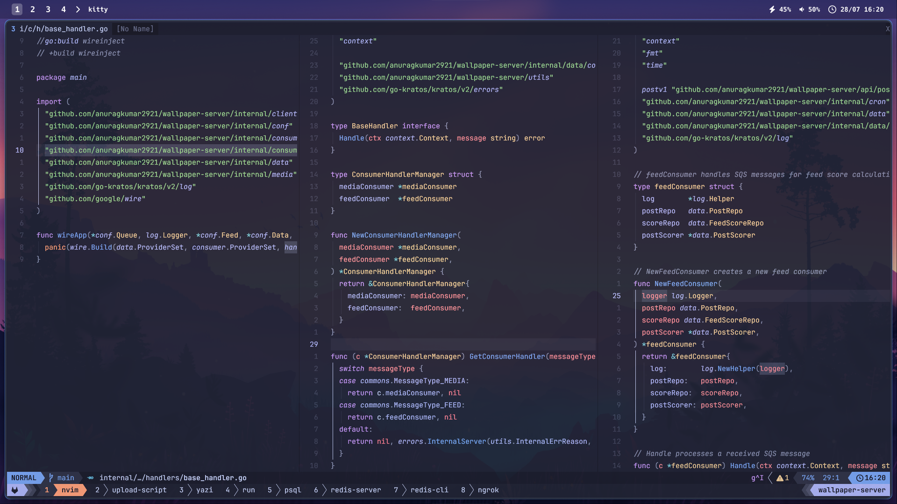

# 🚀 My Dotfiles

**Warning**: Don't blindly use my settings unless you know what that entails. Use at your own risk!

### 🖼️ Looking for a Wallpapers?

Check out my app called 🎨 [WallD](https://www.walld.app/)

[](https://www.walld.app/)

---
📋 Table of Contents

* 🛠️ Requirements
* ⚡ Quick Installation
* 📖 Manual Installation
* 🎯 What's Included
* 📝 Tmux Cheat Sheet
* 🤝 Contributing

---

## 🛠️ Requirements

Before getting started, ensure you have the following installed:

### **1. 🍺 HomeBrew** *(Required)*
```bash
/bin/bash -c "$(curl -fsSL https://raw.githubusercontent.com/Homebrew/install/HEAD/install.sh)"
```
> ⚠️ **Important**: Make sure to add brew to your PATH after installation

### **2. 📦 Git** *(macOS users can skip this)*
```bash
brew install git
```

### **3. 🔗 GNU Stow** *(Not required if using the installation script)*
```bash
brew install stow
```

---

## ⚡ Quick Installation

### 🚀 Automated Setup *(Recommended)*

1. **Download the installation script:**
   ```bash
   curl -O https://raw.githubusercontent.com/anuragkumar2921/dotfiles-public/main/install.sh
   ```

2. **Review the script** (always a good practice):
   ```bash
   cat install.sh
   ```

3. **Run the installation:**
   ```bash
   bash install.sh
   ```

---

## 📖 Manual Installation

If you prefer to set things up manually:

### 1. 📥 Clone the Repository
```bash
cd ~
git clone https://github.com/anuragkumar2921/dotfiles-public.git dotfiles
cd dotfiles
```

### 2. 🔗 Create Symlinks
```bash
stow .
```

---

## 🎯 What's Included

```
📁 .config/
├── 🦇 bat                 # Syntax highlighting for cat
├── 🖼️  borders            # Window borders
├── 📊 btop                # System monitor
├── ⚡ fastfetch           # System info
├── 👻 ghostty             # Terminal emulator
├── 🐱 kitty               # Terminal emulator
├── 🎵 mpd                 # Music player daemon
├── 🖥️  neofetch           # System info
├── ⚡ nvim                # Neovim configuration
├── 📁 ranger              # File manager
├── 🎵 rmpc                # MPD client
├── 📊 sketchybar          # macOS menu bar
├── ⌨️  skhd               # Hotkey daemon
├── 🎵 spotify-player      # Spotify TUI
├── 🖼️  tmux               # Terminal multiplexer
├── 🪟 yabai               # Window manager
├── 📁 yazi                # File manager
└── ⭐ starship.toml       # Cross-shell prompt

📁 zsh/
├── 🔧 aliases.zsh         # Custom aliases
├── 🌍 env.zsh             # Environment variables
├── 🔌 integrations.zsh    # Tool integrations
├── ⚙️  options.zsh        # Shell options
└── 🧩 plugins.zsh         # Plugin configurations
```

---

## 📝 Tmux Cheat Sheet

### 🚀 Session Management

| Action | Command |
|--------|---------|
| **Create new session** | `tmux new -s session_name` |
| **Attach to session** | `tmux attach -t session_name` |
| **List sessions** | `tmux ls` |
| **Kill session** | `tmux kill-session -t session_name` |

### ⚙️ Configuration

| Action | Command |
|--------|---------|
| **Reload config** | `tmux source-file ~/.config/tmux/tmux.conf` |
| **Install plugins** | `prefix + I` |
| **Update plugins** | `prefix + U` |

> 💡 The default prefix key is `Ctrl + b`


---

## 🤝 Contributing

Found a bug or have a suggestion? Feel free to:

1. 🍴 Fork the repository
2. 🌱 Create a feature branch
3. 💾 Commit your changes
4. 📤 Push to the branch  
5. 🔄 Open a Pull Request

---

<div align="center">

**⭐ If you found this helpful, please give it a star! ⭐**

Made with ❤️ by [anuragkumar2921](https://github.com/anuragkumar2921)

</div>
